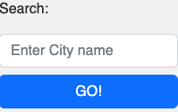
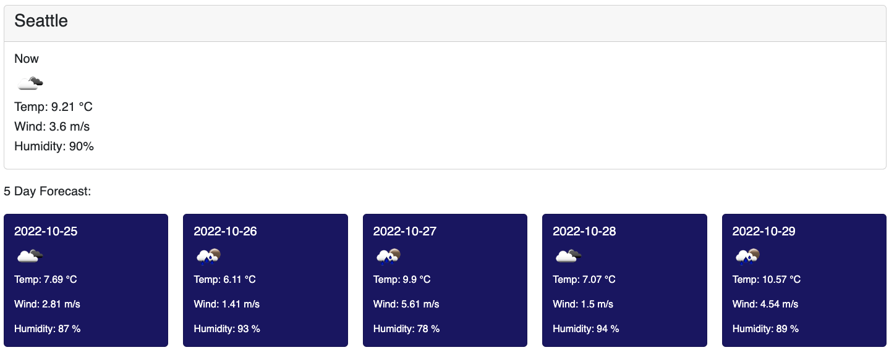

# Weather Dashboard
```
This dashboard will allow you to search for a city to get it´s current weatehr and a 5 day forecast.  
Please read the usage indications below before using it.
```

[Weather Dashboard App](https://jaime-a-esquivel-a.github.io/WeatherDashboard/Index.html)

## Usage

* To search for a city enter the name of it in the search text an click the"GO!" button.  
    
* The current weather will appear on the top of the screen, the 5 forecast day will appear below it.  
    
* When you search for a city the app will remember your search history, you can go back to a given city weather by clicking on the side bar button with the city name.  
    
* If you want to erase your search history just click on the "Clear History" button.  
    
* If we are unable to find the city you're searching for a message will appear at the top "City NOT found".  
    


